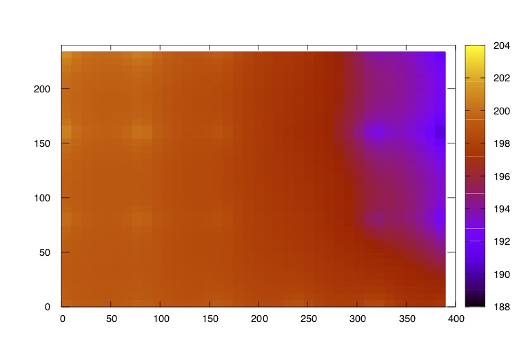

## Numerical Solution to 2D Conduction

It's a course assignment of Heat Transfer, THU 2018 Fall, to give a numerical solution to a third boundary condition 2-D heat transfer problem.

### Description

There is a 240mm\*400mm rectanglular material, whose boundary condition satisfies: left boundary is insulated; right boundary is the third boundary condition, h=40W/(m<sup>2</sup>K), t<sub>f</sub>=25℃; top boundary satisfies the first boundary, and the temperature is 200℃; bottom boundary is the second type, and q<sub>w</sub>=1500W/m<sup>2</sup>。The material is very long and the inside is two-dimensional steady heat conduction. The thermal conductivity is 𝜆=45W/(mK). Divid the grid as 𝛥x=𝛥y=80mm and give the 2D steady temperature contribution.

### Usage

No outside libraries needed. But you also need a command line tool **gnuplot**.

```shell
mkdir build
cd build
cmake ..
make  # The target test is generated
./test  # Then we can see the output file "data.dat"
# Then we use gnuplot to visualize the numerical result
gnuplot
gnuplot> set term postscript eps enhanced color
gnuplot> set xrange [0:400]
gnuplot> set yrange [0:240]
gnuplot> set ticslevel 0
gnuplot> set output "test.eps"
gnuplot> set pm3d at b
gnuplot> set key off
gnuplot> set dgrid3d 40,40
gnuplot> set pm3d map
gnuplot> set hidden3d
gnuplot> set isosample 40,40
gnuplot> splot "data.dat" u 1:2:3 with lines
```

I'm not quite familiar with gnuplot, so there might be other better plot methods :)

### Demo

